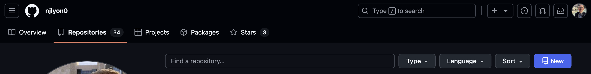
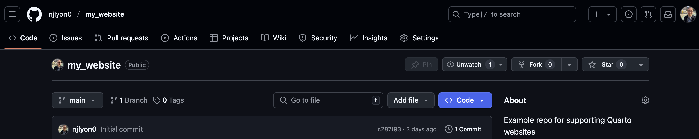
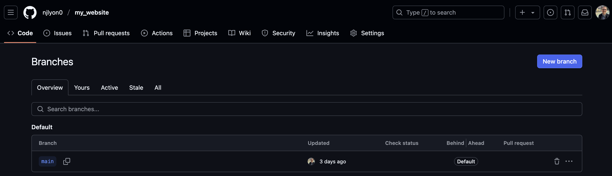
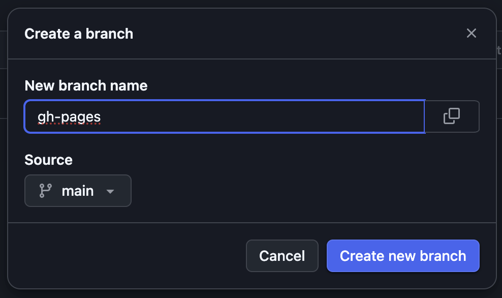
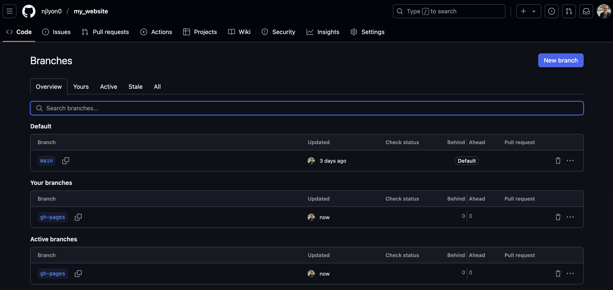
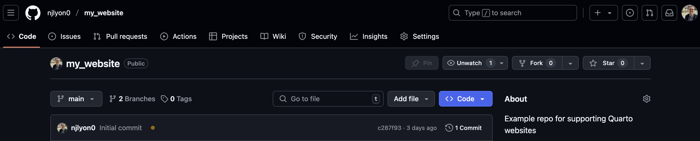

:::{.callout-tip icon="false" collapse="false"}
###  Learning Objectives

By the end of this module, you will be able to:

- <u>Use</u> GitHub to make a new repository
- <u>Create</u> a Quarto website
- <u>Make</u> a new branch on a GitHub repository
- <u>Edit</u> files hosted on GitHub with an IDE

:::

## Make the Website's GitHub Repository

From your GitHub **"Repositories"** tab, click the **"New"** button.

{fig-alt="Screencapture of top bit of 'Repositories' tab of a GitHub user's profile" .lightbox}

In the resulting page, do _all_ of the following

1. Name the repository
2. Add a (short) description
3. **Make it Public**
    - Only public repositories can support websites
4. Click the toggle to include a README
5. Add the R template for the .gitignore
6. Consider whether you want to add a LICENSE
    - Useful if you want to make sure visitors to your website have guidelines on how they're allowed to use the content there

For more information on repository creation or on the .gitignore specifically, see the LTER SciComp GitHub workshop [here](https://lter.github.io/workshop-github/).

### Repository Name & Website URL Aside

The name you pick for your repository (and whose GitHub account owns that repository) determines the URL for the website hosted there! See below for some examples.

Generic: github.com/**<span style="color:purple">owner</span>**/**<span style="color:orange">repository</span>** &nbsp;&nbsp;  &nbsp;&nbsp; **<span style="color:purple">owner</span>**.github.io/**<span style="color:orange">repository</span>**

Specific: github.com/**<span style="color:purple">lter</span>**/**<span style="color:orange">workshop-quarto</span>** &nbsp;&nbsp;  &nbsp;&nbsp; **<span style="color:purple">lter</span>**.github.io/**<span style="color:orange">workshop-quarto</span>**

So, think about a repository name that will make your URL informative without being overly long if someone needs to type it manually.

:::{.callout-warning}
### Repository Name-URL Exception

**There is one critical exception to the above rule** for how the website URL is related to the GitHub repository's name! If the _repository name_ is "owner.github.io" then that will also be the URL for the website (i.e., the "owner" part gets dropped from the URL to simplify things). See below for some examples.

Generic: github.com/**<span style="color:purple">owner</span>**/**<span style="color:orange">owner.github.io</span>** &nbsp;&nbsp;  &nbsp;&nbsp; **owner.github.io**

Specific: github.com/**<span style="color:purple">njlyon0</span>**/**<span style="color:orange">njlyon0.github.io</span>** &nbsp;&nbsp;  &nbsp;&nbsp; **njlyon0.github.io**

:::

## Make a "gh-pages" Branch

GitHub **branches** are typically short-lived development spaces that operate parallel to the 'main' branch of a repository. The main branch is either called "main" or (for older repositories) "master." If you don't think you've used branches so far, you're mistaken! All repositories have at least the main branch by default.

For more information on branches, see the LTER SciComp GitHub workshop [here](https://lter.github.io/workshop-github/).

**Deploying a Quarto website requires you make a branch named _exactly_ "gh-pages".** We will never have to directly work in that branch but GitHub will use it behind-the-scenes to host the website. We could make this branch later, but let's go ahead and do so now while we're here.

### 1. Check the Active Branches

From your repository's home page, **click the " 1 Branch" button**. It is on the left side of the same row of buttons as the "Code" button. Note that you can see your current branch name (likely "main") just to the left of the desired button. 

<p align="center"/>

</p>

### 2. Start Creating a New Branch

In the resulting page, **click the "New Branch" button** in the top right corner.

<p align="center"/>

</p>

### 3. Actually Create the "gh-pages" Branch

The previous step will create a small pop-up window with an empty text field for you to enter the name of your branch. **Type _exactly_ "gh-pages" and click "Create new branch"**. Note that "gh" and "pages" are separated by a hyphen. If you name this branch anything other than "gh-pages", _GitHub will not correctly host your website!_ So, triple check spelling/casing.

<p align="center"/>

</p>

Once you've done that, the pop-up window should close and you should find yourself back on the 'branches' page but there will now be two active branches: your default starting branch and "gh-pages"!

<p align="center"/>

</p>

You can now return to your repository's landing page. You may see an **<span style="color:orange">orange</span>** circle or a check mark that is either **<span style="color:blue">blue</span>** or **<span style="color:green">green</span>** next to the most recent commit message but we can safely ignore this for now.

<p align="center"/>

</p>

## Clone that Repository

Now that you have created a repository, we need to clone it locally so we can create the content we want in our IDE. This workshop assumes that you have some familiarity with the cloning workflow but please feel free to revisit the instructions embedded below from the LTER SciComp GitHub workshop.

```{=html}
<iframe src="https://lter.github.io/workshop-github/ide.html" height="420" width="850" style="border: 1px solid #2e3846;"></iframe>
```

## Start Creating the Website

Now we've cloned the GitHub repository where we want the repository to live, we can create the critical website architecture. These steps are best handled sequentially but are semi-independent of one another so see the following numbered sub-headings for more instructions.

### 1. Add to the `.gitignore`

Using the "Files" pane of RStudio, open the `.gitignore` file. Scroll to the bottom and add the following lines beneath whatever is already in there. Those two folders are important in creating a Quarto website but we don't want Git to track changes to the files that they contain.

```{r expand-gitignore}
#| eval: false

# Ignore unneeded Quarto folders
/.quarto/
docs/
```

:::{.callout-note}
### Other Good `.gitignore` Additions

You might also consider adding the following to your `.gitignore`. This well help keep your repository free of unneeded contents as the website grows.

```{r expand-gitignore-v2}
#| eval: false

# R Project
*.Rproj

# Mac files
.DS_Store
```

:::

### 2. Create the Website Homepage

Now we'll make what will become the home page of your website! **Create a new Quarto file** ("File"  "New File"  "Quarto Document..."). In the resulting pop-up menu you can leave everything at its default position and **click "Create"**.

**Save that file as `index.qmd`**. Technically it doesn't matter where in your project folder it lives but typically you'd leave it in the top level folder (i.e., not in a sub-folder).

:::{.callout-warning}
#### Note on the File Name

This file must be named _exactly_ as indicated above. All lowercase "index" and it is a `.qmd` file.

:::

### 3. Make a YAML File

Now, as discussed in the [Quarto Background](https://lter.github.io/workshop-quarto/background.html) module, Quarto documents--like many computational notebook files--are controlled by a YAML. In the case of RMarkdown, the YAML is a component of each `.Rmd` file. Quarto supports that functionality for single-file formatting but also supports a single over-arching YAML file to control the structure of a whole project, in this case: a website!

So, <u>in the  Terminal pane of RStudio</u>, **run the following command to create the needed type of file with the right name**. Note there is a slight difference depending on your operating system so be sure to use the right one!

:::{.panel-tabset}
####  Mac /  Linux

```{r make-yaml_mac}
#| eval: false

touch _quarto.yml # <1>
```
1. `touch` is CLI-speak for 'create this file'

####  Windows

```{r make-yaml_win}
#| eval: false

copy NUL _quarto.yml # <1>
```
1. This is CLI-speak for 'create this file'

If `copy NUL` does not work, try `touch` instead.

:::

This should create a file called `_quarto.yml` in the top-level of your RStudio project.

### 4. Draft the YAML

Next, as you did with the `.gitignore`, use the "Files" pane of RStudio to open this file. **Copy/paste _all_ of the following into that file**.

```{r customize-yaml}
#| eval: false

project:
  type: website
  execute-dir: project
  output-dir: docs
  render:
    - "*.qmd"

execute: 
  freeze: auto

website:
  title: "My Website" # <1>
  repo-url: https://github.com/lter/workshop-quarto # <2>
  repo-actions: [issue]
  navbar:
    background: primary
    left:
      - text: "Home"
        href: index.qmd
    right: 
      - icon: github
        href: https://github.com/lter/workshop-quarto # <3>
  page-footer: 
    center: "Copyright 2025, LTER Network" # <4>
    background: secondary

format:
  html:
    toc: true
    link-external-newwindow: true
    link-external-icon: false
```
1. Feel free to edit this part! It defines the website title that appears on the left side of the navbar with Quarto.
2. Change this link to your GitHub repository's link
3. Edit this link to the same destination as \#2
4. Change this to be the current year and your name

This YAML will tell GitHub (through Quarto) that you want a simple website with a homepage made from the content of `index.qmd` and a GitHub logo in the top right corner that takes website visitors to the GitHub repository that hosts the website.

### 5. GitHub Housekeeping

We want this to be a Quarto website so we also need to tell GitHub not to use "Jekyll". Jekyll is the default website generation tool for GitHub and would involve extra processing we don't want. We can do this by running the following  command line snippet.

:::{.panel-tabset}
####  Mac /  Linux

```{r no-jekyll_mac}
#| eval: false

touch .nojekyll
```

####  Windows

```{r no-jekyll_win}
#| eval: false

copy NUL .nojekyll
```

If `copy NUL` does not work, try `touch` instead.

:::

There won't actually be anything in this file but the name is enough for GitHub to change its behavior.

### 6. Test it Locally

To make sure that everything is set up properly so far, it is good practice to create the website on your computer (i.e., "locally") before continuing. We can do this with an operating system-agnostic  command line snippet.

```{r preview-site}
#| eval: false

quarto preview
```

This should create a new tab in your default browser application that shows a living version of what your website will look like after GitHub starts hosting it. The preview will keep going until you manually stop it (from the Terminal pane in RStudio) so feel free to make tweaks to either `_quarto.yml` or `index.qmd` while the preview is running. The preview will update a few moments after you save your edits to either of those files.

### 7. Render the Website

Once you're happy with the preview, it's a good call to completely render the website just to make sure all of your most recent edits are reflected. You can do this with the following  command line code.

```{r render-site}
#| eval: false

quarto render
```

This may create a `docs/` folder and a `_freeze/` folder depending on whether you have code chunks in `index.qmd` (or anything else requiring computing power). `docs/` will show up in your file explorer but _not_ the "Git" pane of RStudio because of your edits during step 1. `_freeze/` should show up in both locations.

### 8. Commit & Push!

Once you've done the preceding steps, **Commit the following things: **

1. Your changes to the `.gitignore`
2. `index.qmd`
3. `_quarto.yml` 
4. `.nojekyll`
5. `_freeze/` folder and _all_ of its contents
    - If it exists

**After you've committed these, push them up to the GitHub repository!**

## Activity - Try it Out

:::{.callout-note}
### Your Turn!

Let's take a break while each of you works through the above tutorial on your own computers!

Once everyone has the fundamental structure of a website created and in GitHub we can move on to "deployment" which turns this collection of files into a living website!

:::