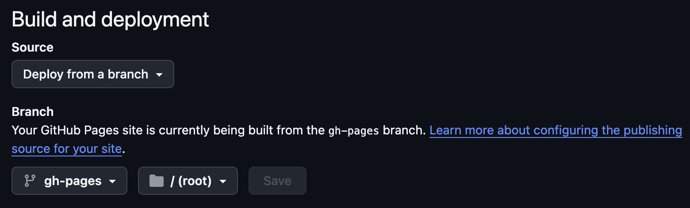
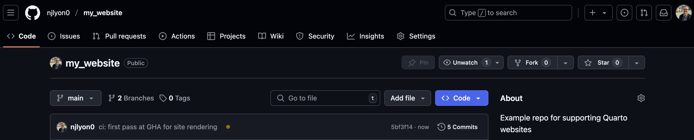
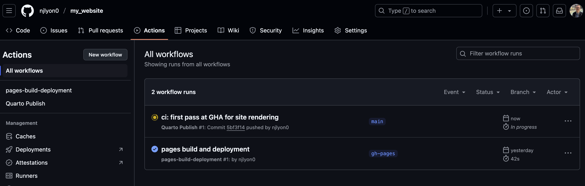
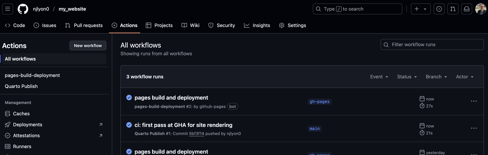
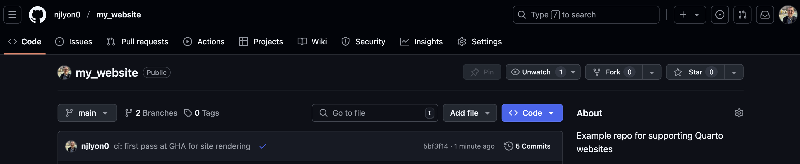
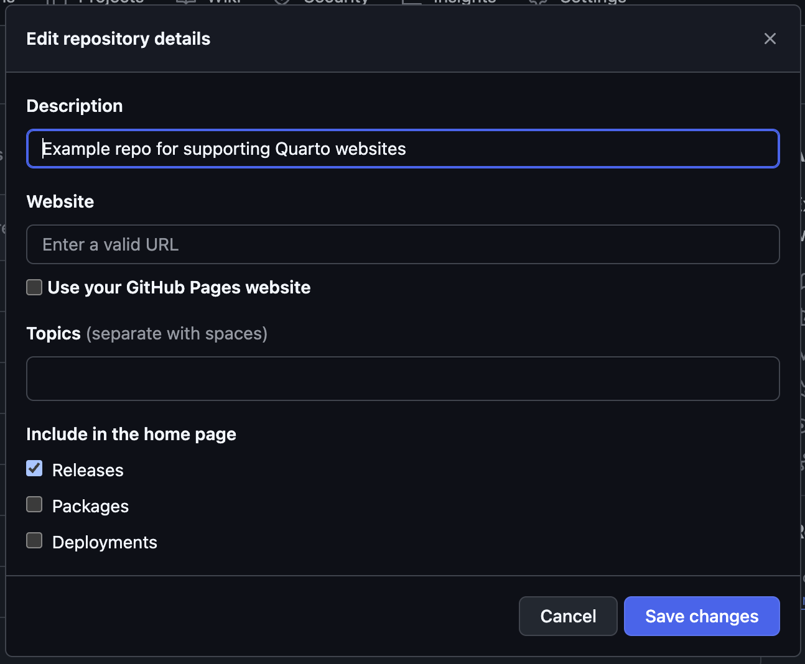
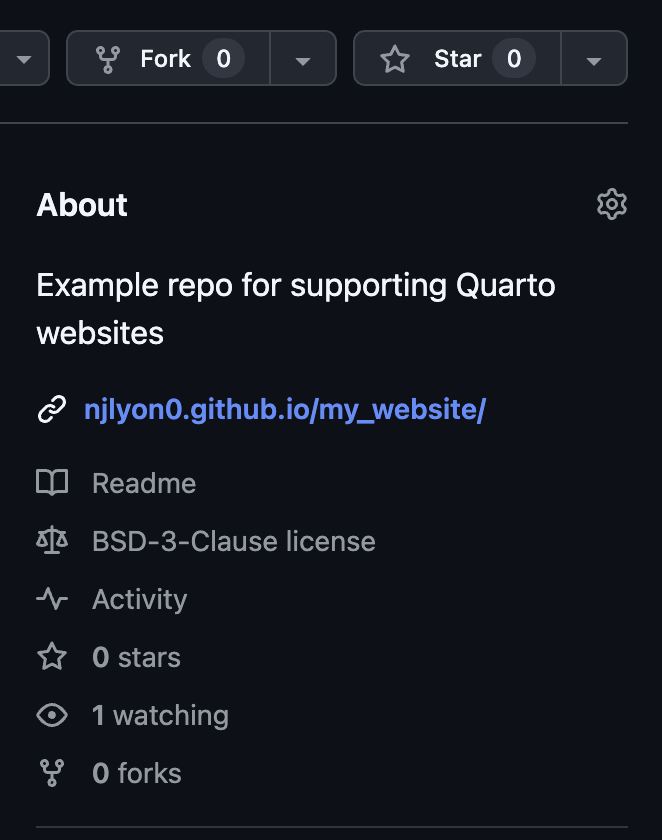

:::{.callout-tip icon="false" collapse="false"}
###  Learning Objectives

By the end of this module, you will be able to:

- <u>Define</u> "deploy" in the context of Quarto websites
- <u>Describe</u> the purpose of GitHub Actions (GHAs)
- <u>Use</u> a GHA to deploy a Quarto website

:::

## Deployment Options

While you created the structure and content of a website earlier in this workshop, you will need to take some additional steps in order to get the website to really exist. This process of translating a Quarto project into a living website is known as "deploying" that website. There are _many_ options for where a website can be deployed but for the purposes of this workshop, we'll be focusing on deploying via GitHub Pages.

We're focusing on deploying via GitHub Pages because:

- General GitHub knowledge translates smoothly to GitHub Pages
- Websites hosted in GitHub can be edited directly through GitHub
    - Reducing the barrier to entry for novice coders interested in editing an existing website
- The LTER Scientific Computing team already encourages the adoption of GitHub for many other purposes
    - E.g., reproducibility, code citation, collaboration, project management

## GitHub Actions (GHAs)

Once you've chosen to deploy via GitHub Pages, there are still several methods for successfully deploying! The instructions in this workshop use a GitHub feature called a "GitHub Action" (GHA) because this allows GitHub to automatically re-render and update the website whenever changes are made to any part of the website's content.

This is a _huge_ benefit for website updating because it reduces the need for manual "rendering" of website files locally and makes it simpler to maintain the website in the long term. Additionally, it also allows many pages in the website to be edited directly through GitHub (because rendering can be done online rather than needing to be done locally).

GitHub supports GHAs for a wide variety of automation purposes beyond website rendering (e.g., running tests on new code, checking compatibility with multiple operating systems, etc.) but the website rendering functionality is a great entry point into the world of GHAs if you do not already use them in your work on GitHub.

Another benefit of this approach is that <u>GitHub Actions are free for public repositories</u>! So you can host a personal, lab, or project website through GitHub without needing to pay anything.

## Set Up the Deployment GHA

### 1. Create the GHA YAML

Because we created a "gh-pages" branch when we first made the repository, all that we need to do to start our GHA is to create the YAML file that tells GitHub what action we want it to perform. GitHub requires that this file be called "publish.yml" and be at the following path within your website repository: `.github` / `workflows` / `publish.yml`. <u>Note that the `.github/` folder name starts with a period!</u>

Once you have this file, **click the collapsed menu below and copy/paste all of its contents into your empty publish.yml file.**

<details> 
<summary>publish.yml Contents</summary>

```{r}
#| label: make-publish-yaml
#| eval: false
on:
  workflow_dispatch:
  push:
    branches: main

name: Quarto Publish

jobs:
  build-deploy:
    runs-on: ubuntu-latest
    permissions:
      contents: write
    steps:
      - name: Check out repository
        uses: actions/checkout@v3

      - name: Set up Quarto
        uses: quarto-dev/quarto-actions/setup@v2

      - name: Render and Publish
        uses: quarto-dev/quarto-actions/publish@v2
        with:
          target: gh-pages
        env:
          GITHUB_TOKEN: ${{ secrets.GITHUB_TOKEN }}
```

</details>

**Do not commit or push/sync this file yet!** We'll get to that in a moment.

### 2. Tweak GitHub Repository Settings

Before we can push our GHA file, we need to change one setting in your GitHub repository. Do the following:

1. Go to your GitHub repository's landing page
2. Click "Settings"
3. Select "Pages" from about halfway down the left sidebar
4. **Make sure your "Build and deployment" section looks _exactly_ like the image below**

{fig-alt="Screenshot of GitHub Pages settings (for a repository) where the 'Source' dropdown menu is set to 'Deploy from a branch' and the 'Branch' dropdown menus are set to 'gh-pages' and '/ (root)' (from left to right)" width="80%" fig-align="center" .lightbox}

### 3. Push the GHA YAML

Once you have created "publish.yml" (in the correct folder) and put the necessary stuff into it, **commit that file and push it**! You may want to run the `quarto render`  CLI code again if you've edited other website files since your last push/sync.

Once you've pushed the "publish.yml" file, return to your repository landing page and you should see an **<span style="color:orange">orange</span>** circle next to that commit message.

{fig-alt="Screenshot of the top part of a GitHub repository's landing page while a GitHub Action is in progress" .lightbox}

If you **click the "Actions" tab** at the top of the repository's landing page you can get more specific information about the GitHub Action's progress.

{fig-alt="Screenshot of the 'Actions' tab of a GitHub repository while a GitHub Action is in progress" .lightbox}

At first, there will be a progress circle next to a "workflow run" that has the same name as the most recent commit. When that finishes it will be replaced by a check mark. Once this finishes, a new action called "pages build and deployment" will automatically start. Once _that_ action is done, you should have an updated website!

{fig-alt="Screenshot of the 'Actions' tab of a GitHub repository while a GitHub Action is complete" .lightbox}

If you don't want to watch the actions complete from the "Actions" tab, you can check their status from the repository landing page; a circle means one of those actions is in progress and a checkmark indicates they are finished.

{fig-alt="Screenshot of the top part of a GitHub repository's landing page after a GitHub Action is complete" .lightbox}

## GitHub Housekeeping

After the GitHub Action completes, your website is live but you'll need to take an extra step to make that link directly-accessible from the landing page of the repository. To start **click the gear () icon next to "About" in the right sidebar of the repository**.

{fig-alt="Screenshot of the pop-up menu that allows editing the 'About' sidebar of a GitHub repository with all fields left at defaults" width="60%" fig-align="center" .lightbox}

In the resulting pop-up menu, **check the box for "Use your GitHub Pages website"** under the "Website" field. Feel free to customize the other fields however you'd like! When you're done, **click the "Save changes" button** to close this menu and update your "About" sidebar.

{fig-alt="Screenshot of the 'About' sidebar of a GitHub repository with a GitHub Pages website included" fig-align="center" width="40%" .lightbox}

You should now see the website in the "About" sidebar of the repository!

## Activity - Try it Out

:::{.callout-note}
### Your Turn!

Let's take a break while each of you works through the above tutorial on your own computers!

Once everyone has a working GitHub Action established we can move on to talking about how to add pages to the site and customize some formatting elements.

:::

## Additional Information

- Quarto deployment documentation: [quarto.org/docs/publishing](https://quarto.org/docs/publishing/)
- GitHub Actions documentation: [github.com/features/actions](https://github.com/features/actions)
