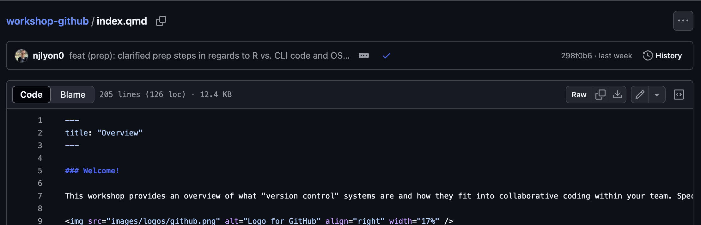
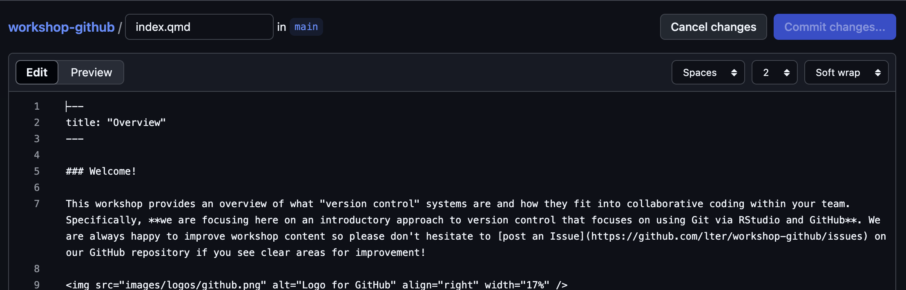
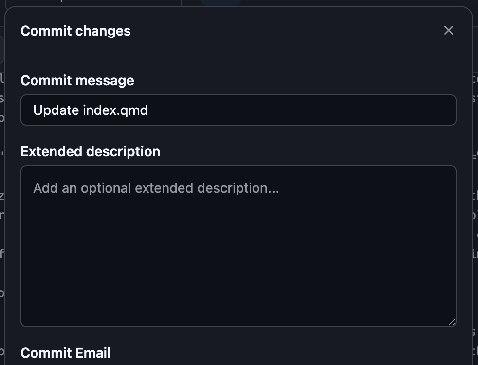

:::{.callout-tip icon="false" collapse="false"}
###  Learning Objectives

By the end of this module, you will be able to:

- <u>Use</u> GitHub to edit an existing website

:::

## GitHub Editing Background

Once you've created and deployed a website some edits can actually be made directly through GitHub! There are some limitations to where this is possible as well as some drawbacks of editing via GitHub but the benefits of this approach can often outweigh the negatives. See below for more details.

:::{.panel-tabset}
### Strengths

See below for some of the primary benefits of editing websites through GitHub:

**1. Edits to website do not require knowledge of an IDE and/or Git**

This makes the barrier to entry for collaborators much lower than it would be for the code workflow developed by your group.

**2. Edits can be implemented more quickly**

For Git experts the increase in efficiency is reduced (because they are faster at working with Git already) but for even intermediate IDE/Git users, it is often faster to edit the website directly in this way.

### Limitations

See below for some of the primary weaknesses of editing websites through GitHub:

**1. Can only edit one file at a time**

As we will shortly demonstrate, GitHub only allows for editing a single file at a time. This is not always an issue but for changes that require editing two files it means that one of the edits is non-functional and may even cause a failure of the GitHub Action for updating the live website. For example adding a new image to the website would require two commits: (1) adding the image to GitHub and (2) embedding that image in the website.

**2. Can't preview changes**

All of the previous modules in this workshop made extensive use of the  `quarto preview` command so that changes to the website could be checked to make sure they work as desired. When editing directly through GitHub, there is no such feature and it is easy to make one-character typos that break either part of a page or the entire website.

**3. Editing through GitHub does not work when code computation is needed**

When the page to edit includes _any_ code chunks, the edited page _must_ be rendered locally (with the  `quarto render` command) for the GitHub Action to succeed and the live site to be updated. So, making edits--even if they are not to the code chunks themselves--on pages that contain code chunks <u>cannot be done successfully through GitHub alone</u>. Note that you may edit one page in a website that includes code chunks so long as _the specific page you are editing_ does not include code chunks.

If you edit a page through an IDE and running the  `quarto render` command causes _any_ changes to the `_freeze/` folder, that page cannot be edited successfully through GitHub. Your intuition for such changes will improve as you work more with Quarto via your IDE and/or GitHub but keeping an eye out for whether Git catches changes to the `_freeze/` folder is a good rule of thumb.

:::

## How to Edit Through GitHub

### 1. Find the Relevant Quarto File on GitHub

**On GitHub, find and click the name of the Quarto file file you want to edit.** In the example below we have clicked the file that builds the website homepage ("index.qmd").

### 2. Start Editing

Once you have opened the file you want to edit, click the pencil icon just above and to the right of the file's contents. This should open a slightly different interface that allows you to edit the file with a "Commit changes..." button (in the top right corner) grayed out until you make at least one change.

After you make any edits, the "Commit changes..." button will become click-able.

### 3. Commit Changes

Once you are done editing, you can commit your changes! Note that the top field is the 'actual' commit message and the "Extended description" will not be immediately apparent when people are looking at the commit history of this repository. **We recommend _replacing_ the default text in the first field with something more informative.** You can of course include extended description if you want but that is not necessary.

All other fields in this pop-up menu can be left at their default positions. Generally, if you wanted one of the non-default options for those you'd be making structural edits that are better suited for editing via an IDE than GitHub directly so these options will likely never be something you need to engage with.

:::{.callout-note}
#### What About Syncing/Pulling and Pushing?

Because you are editing directly in GitHub there is no pull/push step! Pulling is from GitHub and pushing is to GitHub so neither applies when you are already in GitHub.
:::

### 4. Allow the GitHub Action to Complete

Wait a minute or two for the GitHub Action to complete and you should be able to revisit your website and see the new page! The process for the GitHub Action is the same as it was when you first deployed your site so you can either watch the symbol on the repository landing page or get more granular information in the "Actions" tab of the GitHub repository.

:::{.callout-warning}
#### Site Not Updating? Refresh the Page!

If your site is not updating but you've followed the above steps (and the GitHub Action is finished), you might try closing the page and re-opening it or refreshing the page. Sometimes it takes a moment for updates to the site to be visible if you opened the page before the GitHub Action is complete or as it completes and refreshing the page can fix it in this case.

:::

## What If the GHA Fails?

If the GitHub Action fails, **it is likely that your edits required some additional computing that needed to be done locally.** Fortunately, the solution here is straightforward; fix it locally with your IDE with the live preview!

In your IDE of choice:

1. Pull the changes you just made directly through GitHub
2. Run  `quarto preview`
3. Identify and fix the problem areas, double-checking the live preview as needed
4. Re-render everything with  `quarto render`
5. Commit / push _all_ changed files
6. Wait for the (new) GHA complete
