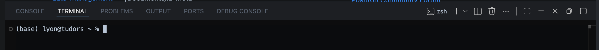
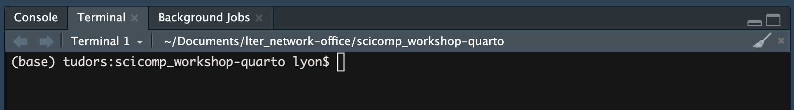

## Welcome!


This workshop covers how to use [Quarto](https://quarto.org/)--a tool developed by Posit--to create easily customizable websites and host those sites on GitHub. Quarto includes a variety of user-friendly tools including a visual editor that allows users to insert headings and embed figures via buttons that are intuitively labeled rather than through somewhat arcane HTML text or symbols. Creating websites using Quarto is very similar to any other work in an <u>I</u>ntegrated <u>D</u>evelopment <u>E</u>nvironment (IDE; e.g., RStudio, Positron) so many of your existing technical skills will likely serve you well here.

### Citing These Materials

If you'd like to cite these materials, please use the following citation:

> Lyon, N.J. (2026). Creating Websites with Quarto (v2.0). Zenodo. [https://doi.org/10.5281/zenodo.20416930](https://doi.org/10.5281/zenodo.20416930)

## Workshop Preparation

To follow along with this workshop you will need to take the following steps:

### 1. Prepare to use GitHub via an IDE

This workshop requires using an <u>I</u>ntegrated <u>D</u>evelopment <u>E</u>nvironment of your choice (e.g., RStudio, Positron), as well as both Git and GitHub. In order to prepare, do all the [pre-workshop steps](https://lter.github.io/workshop-github/#workshop-preparation) relevant to our "Collaborative Coding with GitHub" workshop

```{=html}
<iframe src="https://lter.github.io/workshop-github/#workshop-preparation" height="420" width="850" style="border: 1px solid #2e3846;"></iframe>
```

### 2. Install Quarto

Before you can make a website with Quarto you will need to install it! Go to [quarto.org](https://quarto.org/docs/get-started/) to get started. Quarto seamlessly ties into your IDE software (e.g., RStudio, Positron) so you won't need to learn how to navigate a new program.

:::{.callout-note}
#### Preparation Shortcut!

**If you are _exclusively_ interested in editing an <u>existing</u> Quarto website, all you need to do is create a GitHub profile!**

However, note that editing websites directly through GitHub can cause issues and most such issues _must be resolved in Positron/RStudio_ so the other preparation steps are required if you will be responsible for fixing any issues caused by direct edits to pages in GitHub.

:::

## Note on Code Snippets

Note that while most facets of this workshop can be accomplished in either an IDE or in GitHub, there are some code commands that must be run in an IDE. These commands are mostly <u>C</u>ommand <u>L</u>ine <u>I</u>nterface (CLI) _not_ R code! To make this as clear as possible, **if the plain text instructions have this symbol () they should be run in the "Terminal" pane of your IDE** while R code--if any--will have this symbol ().

In either Positron or RStudio, the "Terminal" tab should be just to the right of the "Console" tab.

:::{.panel-tabset}
### Positron

{fig-alt="Screenshot of 'Terminal' pane of Positron" .lightbox}

### RStudio

{fig-alt="Screenshot of 'Terminal' pane of RStudio" .lightbox}

:::

If you do not have an active Terminal session or don't see a Terminal tab at all (only applies to RStudio), follow the instructions below for your IDE.

:::{.panel-tabset}
### Positron

In Positron, you can make a new Terminal in any of the following ways:

1. Go to the Terminal tab in the lower half of your Positron window and click the  button
2. Go to the Terminal menu at the top of your screen, click it, and select "New Terminal"
3. Use the keyboard shortcut `Ctrl + Shift + backtick`
    - You can find the backtick (`) key just above the tab key (upper left corner) on most keyboards

### RStudio

In RStudio, you can make a new Terminal in any of the following ways:

1. Open a file in the top-level of your RStudio project then click through the following menu items at the top of the screen: "Code"  "Terminal"  "Open New Terminal at File Location".
2. Use the keyboard shortcut `Alt + Shift + R` ( Windows) or `Option + Shift + R` ( Mac)

:::

## Additional Information

Quarto is developing at a rapid pace so quality of life changes and new functionalities are introduced relatively frequently. Additionally, Quarto supports user-created "extensions" that can be downloaded in a given project and then used (similar to the way user-developed R packages can be shared) so if you want to do something that Quarto itself doesn't support, chances are you'll be able to find an extension that handles it.

[Quarto's documentation of website creation and formatting](https://quarto.org/docs/websites/) is extremely thorough and is a great resource as you become more comfortable with your new website.
